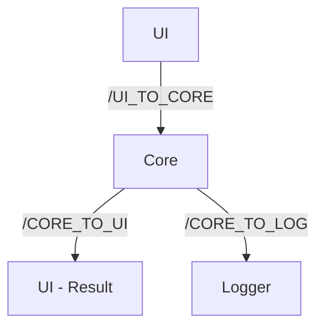

# Multi-Process Simulator with POSIX IPC

A C-based multi-process simulator that demonstrates basic system operations (CPU, memory, stack, and queue) and Inter-Process Communication (IPC) using POSIX Message Queues.

**Platform:** Linux (Ubuntu) | **Language:** C | **Compiler:** GCC

---

## Overview

The simulator is split into independent processes that communicate only through message queues:

- **UI** accepts commands from the user.
- **Core** executes the commands and returns results.
- **Logger** records execution and error events.

This separation shows how real systems keep input handling, processing, and logging independent of each other.

## How It Works

1. The user types a command in the **UI** process.
2. The UI sends it to the **Core** through the `/UI_TO_CORE` queue.
3. The Core executes the command with the matching module (CPU, Memory, Stack, or Queue).
4. The Core sends the result back to the UI through `/CORE_TO_UI`.
5. The Core also sends a log entry to the **Logger** through `/CORE_TO_LOG`.
6. The cycle repeats until the user enters `EXIT`.

## Features

- **CPU:** LOAD, ADD, SUB, MUL, DIV
- **Memory:** STORE, READ
- **Stack:** PUSH, POP, PEEK
- **Queue:** ENQUEUE, DEQUEUE, QPEEK
- Multi-process design using `fork()` and `execl()`
- Message-based IPC using POSIX Message Queues
- Centralized execution and error logging

## Architecture

| Queue | Direction | Purpose |
|---|---|---|
| `/UI_TO_CORE` | UI → Core | Sends user commands |
| `/CORE_TO_UI` | Core → UI | Returns execution results |
| `/CORE_TO_LOG` | Core → Logger | Sends execution and error logs |



## Project Structure

```text
week1/
├── src/
│   ├── core/
│   │   ├── core.c        # Command handling and dispatch
│   │   ├── cpu.c         # CPU operations
│   │   ├── memory.c      # Memory operations
│   │   ├── stack.c       # Stack operations
│   │   ├── queue.c       # Queue operations
│   │   └── simulator     # Compiled executable
│   ├── IPC/
│   │   ├── common.h      # Shared definitions
│   │   └── ipc.c         # Message queue setup and process integration
│   ├── logger.c          # Logging process
│   └── ui.c              # User interface process
└── README.md
```
## Team

| Member | Role | Contribution |
|---|---|---|
| Sameeha | Team Lead | IPC Integration |
| Riya Hency DSA | Developer | Core |
| Shashwath | Developer | Logger |
| Jonnaes | Developer | UI |

## Modules

| Module | Responsibility |
|---|---|
| Core | Executes simulator operations |
| CPU | Arithmetic operations |
| Memory | Address-based storage and retrieval |
| Stack | Last-in, first-out data structure |
| Queue | First-in, first-out data structure |
| UI | Reads user commands |
| Logger | Writes execution and error logs |
| IPC | Connects the processes |

## Command Reference

| Command | Syntax | Description |
|---|---|---|
| LOAD | `LOAD <value>` | Load a value |
| ADD, SUB, MUL, DIV | `ADD <value>` | Arithmetic on the loaded value |
| STORE | `STORE <addr> <value>` | Store a value at an address |
| READ | `READ <addr>` | Read the value at an address |
| PUSH | `PUSH <value>` | Push a value onto the stack |
| POP | `POP` | Remove the top of the stack |
| PEEK | `PEEK` | View the top of the stack |
| ENQUEUE | `ENQUEUE <value>` | Add a value to the queue |
| DEQUEUE | `DEQUEUE` | Remove the front of the queue |
| QPEEK | `QPEEK` | View the front of the queue |
| EXIT | `EXIT` | Terminate the simulator |

## Sample Session

```text
LOAD 10
ADD 5
STORE 5 100
READ 5
PUSH 50
PEEK
POP
ENQUEUE 25
QPEEK
DEQUEUE
EXIT
```

## Technologies

- C
- GCC
- Linux / Ubuntu
- POSIX Message Queues


## Result

A working multi-process simulator that integrates Core, UI, Logger, and IPC through POSIX Message Queues.
